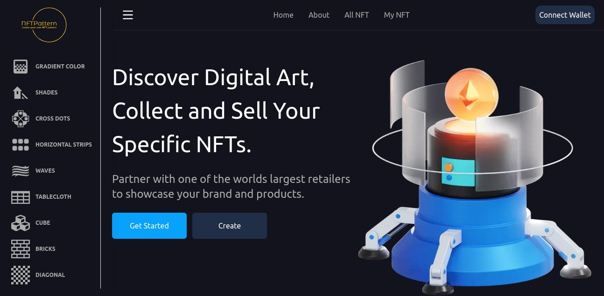
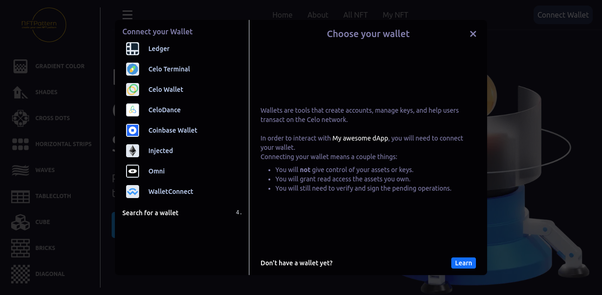
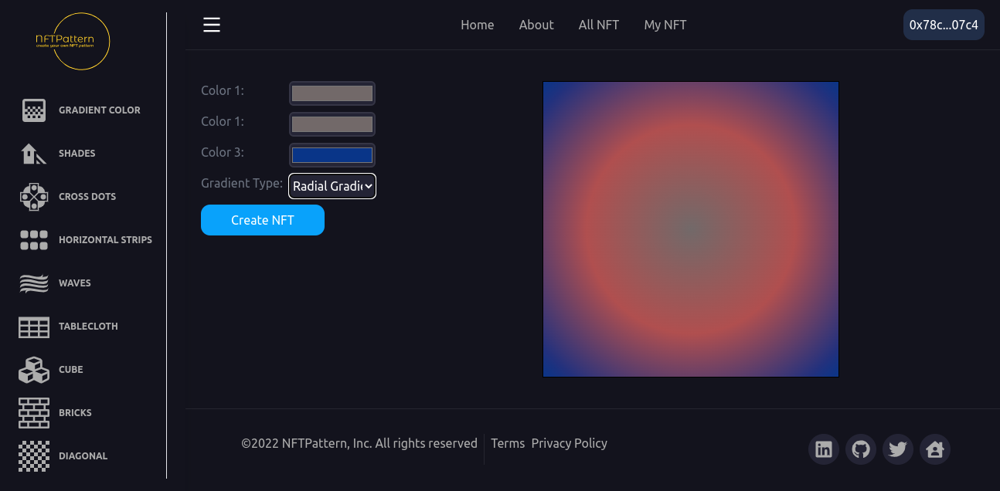
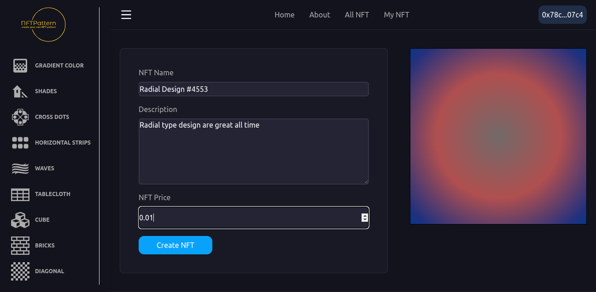
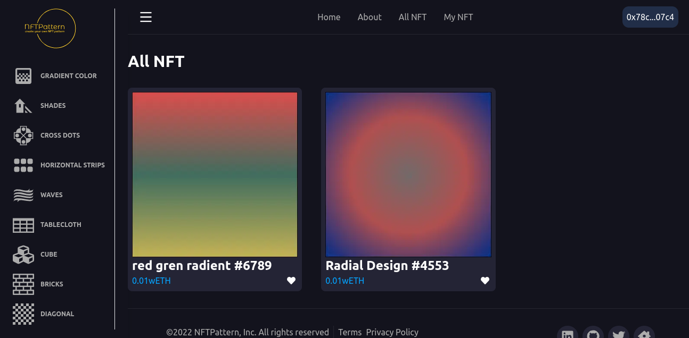
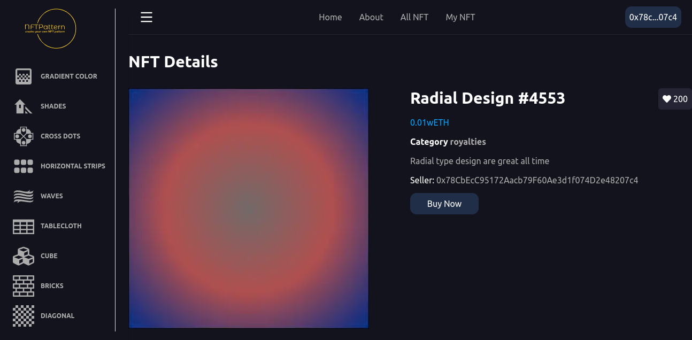
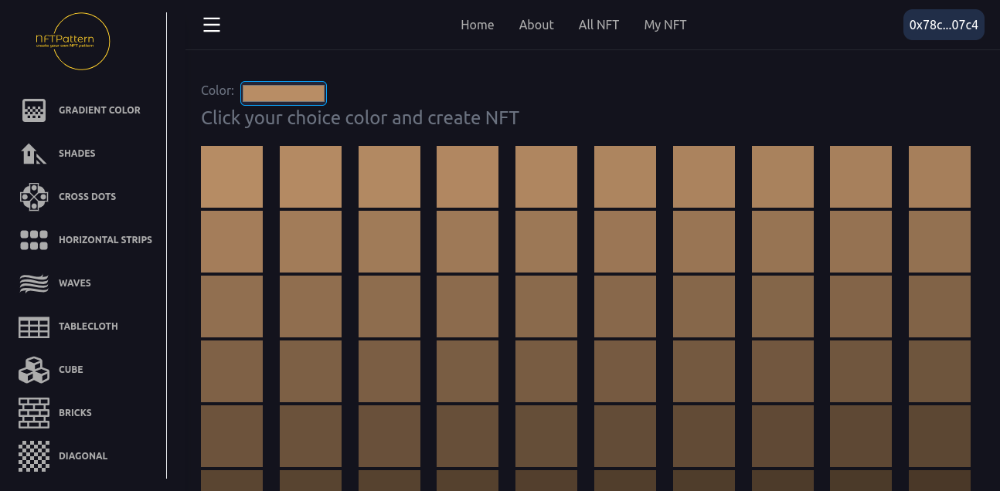
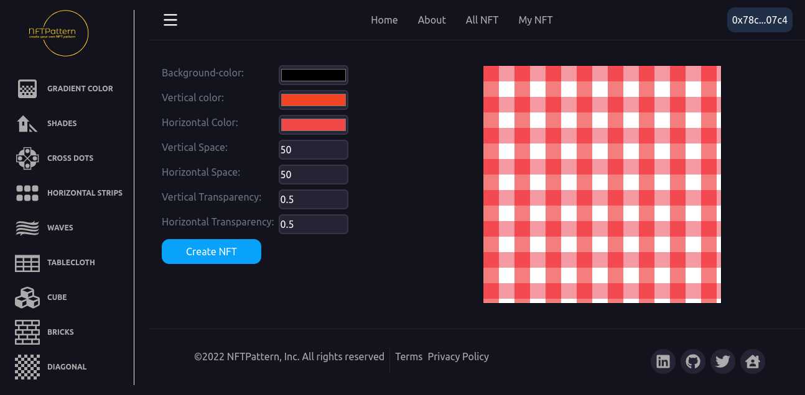
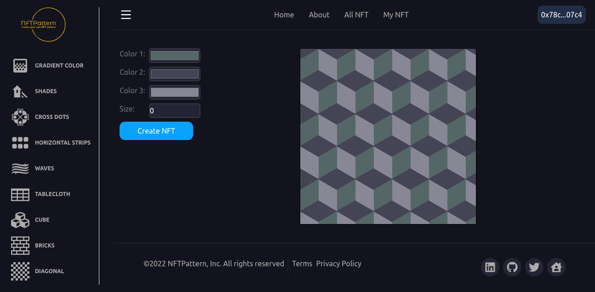
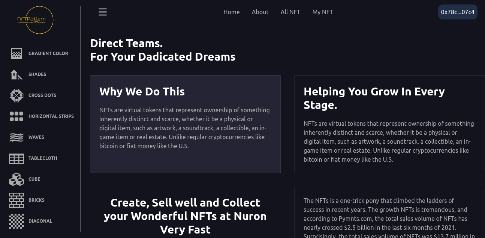

# Project Title

<b>NFTPattern</b>

## Project Description
    - NFTPattern are places to users create their own type pattern and sell it as an NFT.
    - NFTPattern is many tools available for users can create different types of design patterns.
    - User connect many wallets available so user easily connects with our app.
    - Also users can use the design on any other side like any other design, it's a project, mobile, app, etc...
    - NFTPattern are use a cello token so users sell and purchase only cello tokens because this project smart contract is deployed on alfajores testnet.

<!-- Run in Your local environment -->

# Prerequisites

- [nodejs](https://nodejs.org/en/download/) for backend smart contract deploy and testing
- [MetaMask](https://chrome.google.com/webstore/detail/metamask/nkbihfbeogaeaoehlefnkodbefgpgknn) Chrome extension installed in your browser
- [Hardhat](https://hardhat.org/) for local smart contracts deployement and testing
- [nft.storage](https://nft.storage/) account for IPFS storage (free account).
- [alfajores (testnet)](https://celo.org/developers/faucet) alfajores balance for your smart contract deploy and NFT mint

## How to run in your Local environment

<dl>
<dt>Step1: Clone GitHub Project on your PC</dt>
    <dd>
        git clone https://github.com/nayanrdeveloper/cello_colorspay_nft_marketplace
    </dd>
     <dt>Step2 (deploy smart contract):</dt>
     <dd>
        go to the project folder cello_colorspay_nft_marketplace/backend and run following command
        npm install
     </dd>
     <dt>Step-3 (compile smart contract): </dt>
    <dd>
        <ul>
            <li>npx hardhat compile</li>
            <li>This Project is used to hardhat for smart contract deploy</li>
        <ul>
    </dd>
    <dt>Step-4 (deploy smart contract):  </dt>
    <dd>
        <ul>
            <li>npx hardhat --network alfajores  run scripts/deploy.js</li>
            <li>When this command run after showing the console the following result</li>
            <li>Marketplace deployed to [address]</li>
            <li>MyToken deployed address are 0Xfdghfh34n5bghv859gkd34Sth</li>
        </ul>
    </dd>
    <dt>Step-5 (verify smart contract):  </dt>
    <dd>
        npx hardhat verify [address] [parameter] --network alfajores
    </dd>
    <dt>Step- 6 : </dt>
    <dd>
        now go to the cello_colorspay_nft_marketplace directory and change the file env.example to .env and update the following changes
        <ul>
            <li>NEXT_PUBLIC_MARKETPLACE_CONTRACT = "add address of marketplace"</li>
            <li>NEXT_PUBLIC_TOKEN_CONTRACT = "add address of token"</li>
            <li>NEXT_PUBLIC_NFT_STORAGE_KEY = "api of nft.storage (IPFS)"</li>
        </ul>
    </dd>
    <dt>Step- 7 :</dt>
    <dd>
        <ul>
            <li>npm install</li>
            <li>npm run dev</li>
            <li>Open your Project in browser (http://localhost:3000/)<li>
        </ul>
    </dd>
</dl>

### Built With

- [Solidity](https://docs.soliditylang.org/)
- [Hardhat](https://hardhat.org/getting-started/)
- [Next.js](https://nextjs.org/)
- [ethers.js](https://docs.ethers.io/v5/)
- [react-celo](https://github.com/celo-org/react-celo)
- [TailwindCss](https://tailwindcss.com/)

#### User interface

The front end is built with Next JS it's framework of React, it allows users to mint new NFTS and they can find on the home page a complete roadmap for the entire NFT project.

The front-end is built using the following libraries:
<ul>
<li><b>Ethers.js:</b> used as interface between the UI and the deployed smart contract</li>
<li><b>react-celo:</b> for conecting to wallet</li>
<li><b>mobx:</b> for managing the app states (account, balance, blockchain) </li>
<li><b>Tailwind CSS:</b> Styles using TailwindCss</li>  
 </ul>

Connect Wallet

Create new design pattern

Create NFT

All NFTs

NFT Detail

Color Shadow Pattern

Table cloth pattern

Cube Design pattern

About

